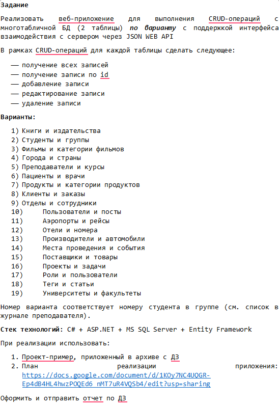

# CarManufacturersAPI

Веб-API приложение для управления автомобилями и производителями.

### ДЗ 15:

Все в точности как из проекта что создавали на паре. Просто с другой бдшкой. Я номер 13. 

### Cars:
- GET /api/cars - получить все автомобили 
- GET /api/cars/{id} - получить автомобиль по ID 
- POST /api/cars - создать новый автомобиль 
- PUT /api/cars/{id} - обновить автомобиль 
- DELETE /api/cars/{id} - удалить автомобиль 

### Manufacturers:
- GET /api/manufacturers - получить всех производителей 
- GET /api/manufacturers/{id} - получить производителя по ID 
- POST /api/manufacturers - создать нового производителя 
- PUT /api/manufacturers/{id} - обновить производителя 
- DELETE /api/manufacturers/{id} - удалить производителя 

## Примеры обработки ошибок

### Cars:
- POST с пустыми данными 
- PATCH с пустыми данными 
- GET с неизвестным ID 

### Manufacturers:
- POST с пустыми данными 
- PATCH с пустыми данными 
- GET с неизвестным ID  